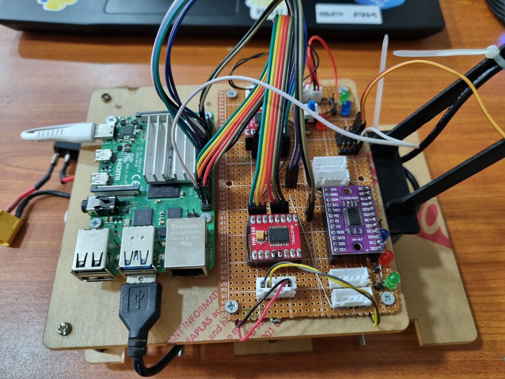

###  Autonomous Robot with Machine Vision

#### Overview:
Our project aims to develop an autonomous robot capable of intelligent navigation and interaction with its environment using machine vision techniques. Leveraging the power of OpenCV and Raspberry Pi, we have created a versatile platform with the ability to track white lines, detect colors, recognize objects, and implement servo jitter reduction for smooth camera control.

#### Main Components:

1. **White Line Tracking:**
   - **Methodology:** Developed a multi-step approach for white line tracking, starting with BGR2GRAY conversion to isolate the grayscale representation of the image. Gaussian blurring is then applied to smooth out noise and reduce pixel-level variations. A thresholding technique is employed to segment the image into binary form, isolating the white pixels representing the line. Finally, a Proportional-Integral-Derivative (PID) controller is utilized to continuously adjust the robot's orientation based on the deviation of the line's center from the camera's field of view.
   - **Algorithm:** The PID controller calculates the error as the pixel deviation of the line's center from the camera's center, adjusting motor speeds accordingly to maintain alignment with the white line.
   
<video src="Pictures/20240316_184156.mp4">
1. **Color Detection:**
   - **Methodology:** Color detection is achieved through histogram analysis and thresholding techniques. The camera captures the environment, and the image is processed to identify regions of interest based on color histograms. Thresholding is then applied to segment these regions, isolating specific colors such as those of distant walls or colored objects.
   - **Algorithm:** Algorithms are developed to analyze color distributions within these segmented regions, enabling the robot to differentiate between different colors and make informed decisions based on environmental cues.

2. **Object Recognition:**
   - **Methodology:** Utilized distance measurements and deviation analysis to differentiate between cylindrical and cuboid objects.
   - **Algorithm:** Developed algorithms to analyze variations in distance measurements and classify objects based on predefined criteria, achieving high accuracy despite potential motion-induced discrepancies.

3. **Servo Jitter Reduction:**
   - **Methodology:** Implemented hardware-timed PWM pulses for servo control to minimize servo jitter. This approach ensures precise and stable servo movements, crucial for tasks such as camera positioning.
   - **Implementation:** By leveraging hardware-timed PWM outputs, servo motors receive consistent control signals, minimizing jitter and ensuring smooth operation. This enhancement significantly improves the stability of the camera mounted on a servo, essential for accurate vision-based tasks.

#### Additional Features:

5. **Checkpoint Identification:**
   - **Methodology:** Implemented a matrix-based system to identify checkpoints and junctions in the robot's navigation path.
   - **Sensor Integration:** Combined virtual and physical IR sensors to detect checkpoint positions and provide feedback for navigation decisions.

6. **Omni-Directional Movement:**
   - **Methodology:** Integrated mechanum wheels for omni-directional movement, enabling agile navigation and alignment with white lines.
   - **Benefits:** Mechanum wheels provide the robot with the ability to move in any direction without changing orientation, enhancing maneuverability and allowing precise adjustments when aligning with white lines.

#### Challenges and Solutions:
- **Calibration:** Addressed calibration challenges due to lighting variations by implementing fixed camera exposure settings and exploring adaptive calibration methods.
- **Latency Optimization:** Optimized code and explored hardware acceleration options to minimize latency and improve real-time responsiveness.
- **Environmental Adaptation:** Investigated adaptive calibration methods to dynamically adjust to changing environmental conditions for enhanced performance.

#### Future Directions:
- **Optimization:** Continue optimizing code for reduced latency and power consumption, exploring parallel processing and hardware acceleration options.
- **Environmental Adaptation:** Investigate adaptive calibration methods using machine learning techniques to dynamically adjust to changing environmental conditions.
- **Sensor Fusion:** Integrate additional sensors such as LIDAR or depth cameras for enhanced environmental perception and obstacle avoidance.

#### Conclusion:
Our project represents a significant advancement in autonomous robotics, leveraging sophisticated machine vision techniques, hardware integration, and advanced control algorithms. By combining methodologies such as PID control for line tracking, histogram analysis for color detection, and hardware-timed PWM pulses for servo control, we have developed a robust and versatile robot platform capable of autonomous navigation and interaction with the environment.
